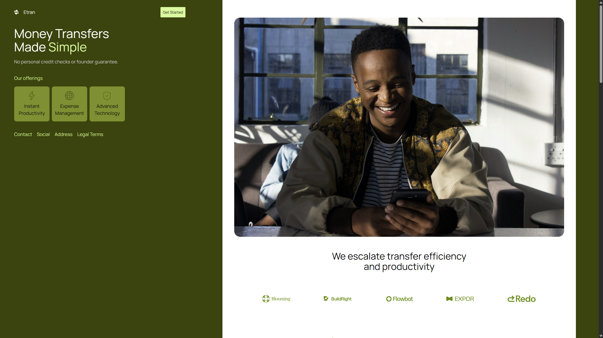
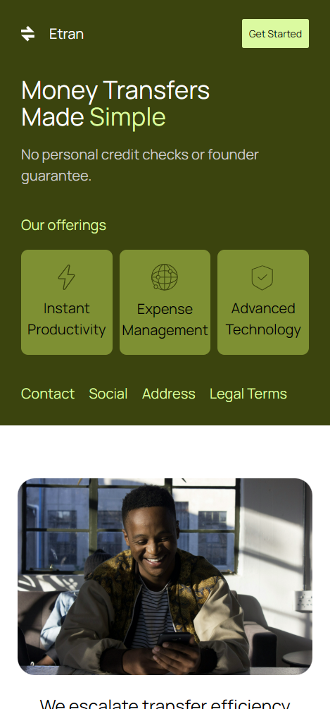

# browse-everything-frontend
Website created by following a figma design, the technologies that were used are html and css. Website used semantic html and responsive css at 3 different sizes.

## Live Demo
[View Live Demo] (https://ner046.github.io/Trustworthy-App/)

## Screenshots
- Desktop Design

- Mobile Design

## Features

- Fully Responsive design
- Clean modern design following figma template
- desktop sidebar

## Technologies Used

- HTML5
- CSS3